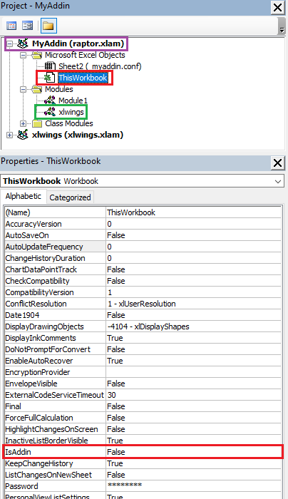
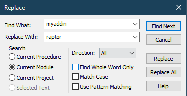

# Excel Add-In

## Benutzung des Excel Add-Ins
Das Add-In gibt aktuell eine einzige Funktion aus:

```
=RAPTOR(
    Volumen NaOH (range);
    pH Werte (range);
    Überschrift (Text) = Titrationskurve;
    Unterüberschrift (Text) = "";
    Breite (Zahl) = 8;
    Höhe (Zahl) = 5
)

Beispiele:

=RAPTOR(A3:A21;B3:B21)
=RAPTOR(A3:A21;B3:B21;"Titrationskurve 1. Titration";"Von Alice und Bob";"8; 5")
```


---

## For developers

### Installing the Excel Add-In
1. Download the three `.whl` files and the `raptor.xlam` from this project's GitHub Releases: [https://github.com/Gustav267/Raptor/releases/latest](https://github.com/Gustav267/Raptor/releases/latest)
2. Install the `.whl` files with python's pip.
3. Restart your shell and install the add in with xlwings:

```powershell
xlwings addin install --path <PATH TO ADDIN FILE>.xlam
```


### Generating the python bindings for the Excel Functions
1. Create the Excel Add-In template by running `just addin_create` in a terminal, inside this project's folder.
2. Open the file `dist/raptor.xlam` in Excel and press `Alt`+`F11` to open Macro Settings.
3. Go to the Project view and open: `MyAddin (raptor.xlam) > Microsoft Excel Objects > ThisWorkbook` (red box).



4. Change the property `IsAddin` to false (red box).
5. In the worksheet window, rename the current worksheet to `raptor.conf`, and put `chemistry_raptor_excel` in cell `B6`.
6. In the project explorer from Step 3, right-click the root node (purple box) `MyAddin (raptor.xlam)`, select `MyAddin Properties...` and rename the `Project Name` from `MyAddin` to `raptor`.
7. Then open the `xlwings` module (green box) with a double-click. Using `Ctrl`+`F` replace all occurences of `myaddin` with `raptor`.



8. Press `F5` to run a function and select `ImportPythonUDFsToAddin` and click on run.
9. Change the `IsAddin` property back to `True` (see step 4)
10. Press the save Icon in the Menu Bar and close Excel.
11. Done!